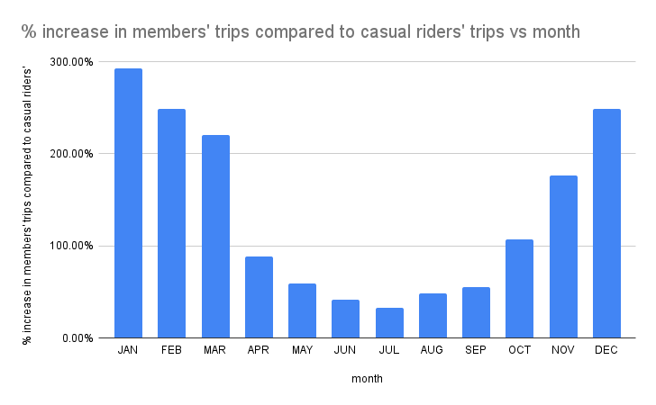
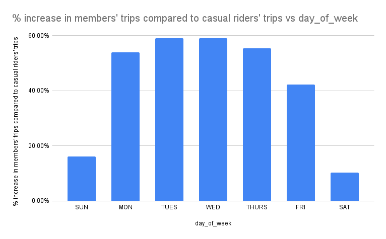

# Google Data Analytics Capstone: Cyclistic Case Study

## Quick Links

Data Source: [divvy_tripdata](https://divvy-tripdata.s3.amazonaws.com/index.html)

SQL Queries: 
01. [Data Combining](SQL_queries/01.%20Data%20Combinig.sql)
02. [Data Structure and Row Count](SQL_queries/02.%20Data%20Structure%20and%20Row%20Count.sql)
03. [Data Cleaning](SQL_queries/03.%20Data%20Cleaning.sql)
04. [Data Analysis](SQL_queries/04.%20Data%20Analysis.sql)

R scripts:
[Import Dataset from Bigquery to R](R_scripts/Import%20Dataset%20to%20R.R)

Data Visualizations: [Tableau](https://public.tableau.com/views/CyclisticCaseStudy_17271895024960/CyclisticDashboard?:language=en-US&:sid=&:redirect=auth&:display_count=n&:origin=viz_share_link)

----

- [Google Data Analytics Capstone: Cyclistic Case Study](#google-data-analytics-capstone-cyclistic-case-study)
  - [Quick Links](#quick-links)
  - [Introduction](#introduction)
  - [About the Company](#about-the-company)
  - [Scenario](#scenario)
  - [Ask](#ask)
    - [What is the Problem I am Trying to Solve?](#what-is-the-problem-i-am-trying-to-solve)
    - [Business Task](#business-task)
    - [Key Stakeholders](#key-stakeholders)
  - [Prepare](#prepare)
    - [Where is Your Data Located?](#where-is-your-data-located)
    - [How is the Data Organized?](#how-is-the-data-organized)
    - [Are There Issues with Bias or Credibility in This Data? Does Your Data ROCCC?](#are-there-issues-with-bias-or-credibility-in-this-data-does-your-data-roccc)
    - [How Are You Addressing Licensing, Privacy, Security, and Accessibility?](#how-are-you-addressing-licensing-privacy-security-and-accessibility)
    - [How Did You Verify the Data’s Integrity?](#how-did-you-verify-the-datas-integrity)
    - [How Does It Help You Answer Your Question?](#how-does-it-help-you-answer-your-question)
    - [Are There Any Problems with the Data?](#are-there-any-problems-with-the-data)
  - [Process](#process)
    - [Tool Used for This Step](#tool-used-for-this-step)
    - [Combining the Data](#combining-the-data)
      - [Data Structure and Row Count](#data-structure-and-row-count)
      - [Datatype](#datatype)
    - [Data Checking and Cleaning](#data-checking-and-cleaning)
      - [Checking for Nulls](#checking-for-nulls)
      - [Checking for duplicates](#checking-for-duplicates)
      - [Checking the Length of Characters in ride\_id](#checking-the-length-of-characters-in-ride_id)
      - [Checking the Total Number of Start and End Stations](#checking-the-total-number-of-start-and-end-stations)
      - [Checking the User Types and Ride Frecuency](#checking-the-user-types-and-ride-frecuency)
      - [Checking the Bike Types](#checking-the-bike-types)
    - [Creating a New, Cleaned, and Transformed Dataset](#creating-a-new-cleaned-and-transformed-dataset)
      - [Data Transforming](#data-transforming)
      - [Checking for Nulls in the Cleaned and Transformed Dataset](#checking-for-nulls-in-the-cleaned-and-transformed-dataset)
      - [Number of Rows in the Cleaned and Transformed Dataset](#number-of-rows-in-the-cleaned-and-transformed-dataset)
  - [Analyse](#analyse)
    - [Annual Summary Statistics](#annual-summary-statistics)
    - [Annual Summary Statistics for Members and Casual Riders](#annual-summary-statistics-for-members-and-casual-riders)
      - [Ride Length](#ride-length)
      - [Median Ride Duration](#median-ride-duration)
      - [Bike Type Preference](#bike-type-preference)
      - [Total Trips by Month](#total-trips-by-month)
      - [Total Trips by Day of the Week](#total-trips-by-day-of-the-week)
      - [Median Ride Lenght by Day](#median-ride-lenght-by-day)
      - [Median Ride Lenght by Month](#median-ride-lenght-by-month)
      - [Total Trips by Hour](#total-trips-by-hour)
  - [Share](#share)
    - [Data Loading in Tableau](#data-loading-in-tableau)
    - [Importing Data from BigQuery to R](#importing-data-from-bigquery-to-r)
    - [Annual Summary](#annual-summary)
    - [Bike Preference](#bike-preference)
    - [Seasonal Trends](#seasonal-trends)
    - [Weekly and Hourly Trends](#weekly-and-hourly-trends)
    - [Top 5 Starting Stations](#top-5-starting-stations)
  - [Final observations](#final-observations)
  - [Act](#act)
    - [Recommendations for the Marketing Team](#recommendations-for-the-marketing-team)


## Introduction
In this case study, I work for a fictional company called **Cyclistic**, along with some key team members. To answer the business questions, I will follow the steps of the data analysis process: **Ask**, **Prepare**, **Process**, **Analyze**, **Share**, and **Act**.

## About the Company
In 2016, **Cyclistic** launched a successful bike-share program. Since then, the fleet has grown to 5,824 bicycles, which are geotracked and locked into a network of 692 stations across Chicago. The bikes can be unlocked from one station and returned to any other station in the system at any time.
Until now, **Cyclistic**’s marketing strategy relied on building general awareness and appealing to broad consumer segments. One approach that facilitated this was the flexibility of its pricing plans: single-ride passes, full-day passes, and annual memberships. Customers who purchase single-ride or full-day passes are referred to as casual riders, while those who purchase annual memberships are considered **Cyclistic** members.
**Cyclistic**’s financial analysts have concluded that annual members are much more profitable than casual riders. Although the pricing flexibility helps **Cyclistic** attract more customers, Moreno believes that maximizing the number of annual members will be crucial for future growth. Instead of creating a marketing campaign that targets all new customers, Moreno believes there is a solid opportunity to convert casual riders into members. She notes that casual riders are already aware of the **Cyclistic** program and have chosen **Cyclistic** for their mobility needs.
Moreno has set a clear goal: design marketing strategies aimed at converting casual riders into annual members. However, to achieve this, the team needs to better understand how annual members and casual riders differ, why casual riders would consider buying a membership, and how digital media could influence their marketing tactics. Moreno and her team are interested in analyzing **Cyclistic**'s historical bike trip data to identify trends.

## Scenario
I am a junior data analyst working on the marketing analyst team at **Cyclistic**, a bike-share company in Chicago. The director of marketing believes that the company’s future success depends on maximizing the number of annual memberships. Therefore, my team wants to understand how casual riders and annual members use **Cyclistic** bikes differently. From these insights, my team will design a new marketing strategy to convert casual riders into annual members. However, **Cyclistic** executives must approve my recommendations, so they must be supported by compelling data insights and professional data visualizations.

## Ask
Three questions will guide the future marketing program:
1. How do annual members and casual riders use **Cyclistic** bikes differently?
2. Why would casual riders buy **Cyclistic** annual memberships?
3. How can **Cyclistic** use digital media to influence casual riders to become members?

Moreno has assigned me the first question to answer:
**How do annual members and casual riders use **Cyclistic** bikes differently?**

### What is the Problem I am Trying to Solve?
- Casual bike riders are less profitable than annual members.

### Business Task
**Understand how annual members and casual riders differ in order to design a new marketing strategy to convert casual riders into annual members.** 

Understanding the differences and factors influencing casual riders versus annual riders would allow for targeted marketing strategies aimed at converting casual riders into annual members.

### Key Stakeholders
- **Lily Moreno**: Director of marketing and my manager.
- **Cyclistic executive team**: The notoriously detail-oriented executive team will decide whether to approve the recommended marketing program.

## Prepare
### Where is Your Data Located?
The bike share data is publicly available on the official website of the bike share service, Divvy Bikes. It was downloaded as CSV files directly from the website [Divvy Trip Data](https://divvy-tripdata.s3.amazonaws.com/index.html).

### How is the Data Organized?
The data from the year 2023 will be used. Each file consists of 13 columns:
- ride_id
- rideable_type
- started_at
- ended_at
- start_station_name
- start_station_id
- end_station_name
- end_station_id
- start_lat
- start_lng
- end_lat
- end_lng
- member_casual

### Are There Issues with Bias or Credibility in This Data? Does Your Data ROCCC?
- **Bias**: The data might not be biased because it includes trips from users who utilize both standard two-wheeled bikes and specialized bikes, such as reclining bikes, hand tricycles, and cargo bikes. This diversity makes the bike share program more inclusive.
- **Credibility**: The dataset comes from an official source, which lends it credibility. However, there could be concerns about incomplete data, especially for casual riders who might not provide demographic information.
- **ROCCC**: The data adheres to ROCCC principles (Reliable, Original, Comprehensive, Current, Cited) as it is provided by an official, original source and is comprehensive in terms of covering a large number of trips over a specific time period.

### How Are You Addressing Licensing, Privacy, Security, and Accessibility?
- **Licensing**: The data is provided under a specific data license that allows its use for analysis and non-commercial purposes. We comply with all terms and conditions outlined in the [license agreement](https://divvybikes.com/data-license-agreement).
- **Privacy**: The dataset is anonymized, meaning it doesn’t include personally identifiable information (PII) like names or addresses, ensuring user privacy.
- **Security**: The dataset is securely hosted on the bike share service’s official website, ensuring data integrity.
- **Accessibility**: The data is freely available to the public, ensuring it is accessible to anyone who wishes to use it for analysis.

### How Did You Verify the Data’s Integrity?
The data integrity was verified by:
- Checking for missing values and ensuring there were no gaps in key variables like trip duration, station data, or timestamps.
- Confirming that the data types were correct (e.g., numerical values for duration, categorical for user type).
- Removing duplicate records that could distort the analysis.
- Cross-checking a sample of data entries with external reports to ensure accuracy.

### How Does It Help You Answer Your Question?
The dataset provides key insights into the behavior of casual and annual riders, helping to identify trends such as trip duration, frequency of use, and popular stations. This information is crucial for understanding how to convert casual riders into annual members.

### Are There Any Problems with the Data?
- Some issues might arise with missing or incomplete entries, especially for casual riders who might not provide full information.
- The dataset does not include demographic details, which could limit the ability to analyze specific rider segments.
- There may also be seasonal or weather-related factors that affect ridership, which aren’t included in the dataset.

## Process
### Tool Used for This Step
**BigQuery** is utilized to merge multiple datasets into one and to clean the data. 

**Reason**: Microsoft Excel can only handle up to 1,048,576 rows per worksheet, limiting its ability to manage large datasets. Since the **Cyclistic** dataset contains over 5.7 million rows, it is crucial to use a platform like BigQuery that can handle such large-scale data efficiently. Data was downloaded in 12 files in .csv format. Each data file corresponds to each month in 2023.

### Combining the Data
**View SQL queries: [Data Combining](SQL_queries/01.%20Data%20Combinig.sql)**

I created a database in BigQuery named bikes_2023. Then, I created 12 tables and uploaded each CSV file to this dataset. Files larger than 100 MB were compressed to .gz format because BigQuery only supports local uploads below 100 MB in the free version. 
Afterward, all tables were combined into a single table to proceed with cleaning and transforming the data.

```sql
-- After importing the 12 files as tables, I merged them all into one single table for ease of use.

CREATE TABLE `bikes_2023.combined_data` AS (
  SELECT * 
  FROM `your_project_id.bikes_2023.bikes_2023_01` 
  UNION ALL
  SELECT * 
  FROM `your_project_id.bikes_2023.bikes_2023_02` 
  UNION ALL
  SELECT * 
  FROM `your_project_id.bikes_2023.bikes_2023_03` 
  UNION ALL
  SELECT * 
  FROM `your_project_id.bikes_2023.bikes_2023_04` 
  UNION ALL
  SELECT * 
  FROM `your_project_id.bikes_2023.bikes_2023_05` 
  UNION ALL
  SELECT * 
  FROM `your_project_id.bikes_2023.bikes_2023_06` 
  UNION ALL
  SELECT * 
  FROM `your_project_id.bikes_2023.bikes_2023_07` 
  UNION ALL
  SELECT * 
  FROM `your_project_id.bikes_2023.bikes_2023_08` 
  UNION ALL
  SELECT * 
  FROM `your_project_id.bikes_2023.bikes_2023_09`  
  UNION ALL
  SELECT * 
  FROM `your_project_id.bikes_2023.bikes_2023_10` 
  UNION ALL
  SELECT * 
  FROM `your_project_id.bikes_2023.bikes_2023_11` 
  UNION ALL
  SELECT * 
  FROM `your_project_id.bikes_2023.bikes_2023_12` 
)
;
```
#### Data Structure and Row Count
**View SQL queries [Data Structure and Row Count]**(SQL_queries/02.%20Data%20Structure%20and%20Row%20Count.sql)

The combined dataset contains 5,719,877 rows for the entire year of 2023.

```sql
-- Count the number of rows in our new table (5,719,877 rows)

SELECT
  COUNT(*) AS num_of_rows
FROM
  `your_project_id.bikes_2023.combined_data`
  ;
```
```sql
num_of_rows
5719877
```
#### Datatype
```sql
-- Check the data type of each column.

SELECT column_name, data_type
FROM `your_project_id.bikes_2023`.INFORMATION_SCHEMA.COLUMNS
WHERE table_name = 'combined_data'
;
```
The output table below shows 13 columns and their data types. The column ride_id is the primary key.

```sql
column_name	data_type
ride_id	STRING
rideable_type	STRING
started_at	TIMESTAMP
ended_at	TIMESTAMP
start_station_name	STRING
start_station_id	STRING
end_station_name	STRING
end_station_id	STRING
start_lat	FLOAT64
start_lng	FLOAT64
end_lat	FLOAT64
end_lng	FLOAT64
member_casual	STRING
```
### Data Checking and Cleaning

**View SQL queries: [Data Cleaning](SQL_queries/03.%20Data%20Cleaning.sql)**

#### Checking for Nulls
```sql
-- checking for number of null values in all columns

SELECT COUNT(*) - COUNT(ride_id) ride_id,
 COUNT(*) - COUNT(rideable_type) rideable_type,
 COUNT(*) - COUNT(started_at) started_at,
 COUNT(*) - COUNT(ended_at) ended_at,
 COUNT(*) - COUNT(start_station_name) start_station_name,
 COUNT(*) - COUNT(start_station_id) start_station_id,
 COUNT(*) - COUNT(end_station_name) end_station_name,
 COUNT(*) - COUNT(end_station_id) end_station_id,
 COUNT(*) - COUNT(start_lat) start_lat,
 COUNT(*) - COUNT(start_lng) start_lng,
 COUNT(*) - COUNT(end_lat) end_lat,
 COUNT(*) - COUNT(end_lng) end_lng,
 COUNT(*) - COUNT(member_casual) member_casual
FROM `your_project_id.bikes_2023.combined_data`;
````

The table bellow shows the number of null values for all columns.


| column             | num null values |
| ------------------ | --------------- |
| ride_id            | 0               |
| rideable_type      | 0               |
| started_at         | 0               |
| ended_at           | 0               |
| start_station_name | 875716          |
| start_station_id   | 875848          |
| end_station_name   | 929202          |
| end_station_id     | 929343          |
| start_lat          | 0               |
| start_lng          | 0               |
| end_lat            | 6990            |
| end_lng            | 6990            |
| member_casual      | 0               |

#### Checking for duplicates

```sql
-- I check to see if there are duplicate rides. There are none.

SELECT COUNT(ride_id) - COUNT(DISTINCT ride_id) AS duplicate_rows
FROM `your_project_id.bikes_2023.combined_data`
;
```
There are no duplicate records, so there is no need for cleaning.

```sql
duplicate_rows
0
```
#### Checking the Length of Characters in ride_id
```sql
-- ride_id - all have length of 16

SELECT LENGTH(ride_id) AS length_ride_id, COUNT(ride_id) AS no_of_rows
FROM `your_project_id.bikes_2023.combined_data`
GROUP BY length_ride_id;
```
All entries in the ride_id column have the same length of 16 characters, so there is no need for cleaning.

```sql
| length_ride_id | no_of_rows |
| -------------- | ---------- |
| 16             | 5719877    |
```
#### Checking the Total Number of Start and End Stations
I also performed the following queries to find out how many stations there are and how many types of members exist.

```sql
--  I check there are 1592 station from start_station_name

SELECT COUNT(DISTINCT start_station_name) AS num_start_station
FROM `your_project_id.bikes_2023.combined_data`
WHERE start_station_name IS NOT NULL;
```
```sql
num_start_station
1592
```
```sql
-- I check there are 1597 station from end_station_name
SELECT COUNT(DISTINCT end_station_name) AS num_end_station
FROM `your_project_id.bikes_2023.combined_data`
WHERE end_station_name IS NOT NULL;
```
```sql
num_end_station
1597
```
There are 1,592 start stations and 1,597 end stations.

#### Checking the User Types and Ride Frecuency
```sql
-- unique 2 values, count of annual member and casual
SELECT DISTINCT member_casual, COUNT(member_casual) AS no_of_trips
FROM `your_project_id.bikes_2023.combined_data`
GROUP BY member_casual;
```
```sql
member_casual	no_of_trips
member	3660698
casual	2059179
```
#### Checking the Bike Types
I performed the following query to see there are 3 types of bikes.
```sql
-- rideable_type - 3 unique types of bikes
SELECT rideable_type, COUNT(rideable_type) AS number_of_trips
FROM `your_project_id.bikes_2023.combined_data`
GROUP BY rideable_type;
```
The table below shows the number of trips of each bike type.
```sql
rideable_type	num_of_trips
electric_bike	2945579
classic_bike	2696011
docked_bike	    78287
```
### Creating a New, Cleaned, and Transformed Dataset
I created a new table **'combined_data_cleaned'** with the following columns, removing null values:

- ride_id,
- rideable_type,	
- started_at,	
- ended_at,	
- start_station_name,	
- end_station_name,	
- start_lat,	
- start_lng,
- end_lat,
- end_lng,
- member_casual,

#### Data Transforming
The following new columns were added for further analysis:
- day_number
- day_week_name
- month
- tripduration (length of rides excluding those trips longer than 1 day and shorter than 1 minute)

```sql
-- I created a new table called 'combined_data_cleaned' 
-- in the 'bikes_2023' dataset. It selects relevant columns from the 
-- 'combined_data' table, calculates the trip duration in minutes, 
-- and adds new columns for the day of the week and month, using 
-- CASE statements for better readability. 
-- The query also filters out records with missing station names, 
-- IDs, and coordinates, as well as trips that are either too short 
-- (1 minute or less) or too long (more than 24 hours).

CREATE TABLE `your_project_id.bikes_2023.combined_data_cleaned` AS
SELECT 
    ride_id,
    rideable_type,	
    started_at,	
    CASE EXTRACT(DAYOFWEEK FROM started_at) 
      WHEN 1 THEN 'SUN'
      WHEN 2 THEN 'MON'
      WHEN 3 THEN 'TUES'
      WHEN 4 THEN 'WED'
      WHEN 5 THEN 'THURS'
      WHEN 6 THEN 'FRI'
      WHEN 7 THEN 'SAT'    
    END AS day_of_week,
    ended_at,	
    CASE EXTRACT(MONTH FROM started_at)
      WHEN 1 THEN 'JAN'
      WHEN 2 THEN 'FEB'
      WHEN 3 THEN 'MAR'
      WHEN 4 THEN 'APR'
      WHEN 5 THEN 'MAY'
      WHEN 6 THEN 'JUN'
      WHEN 7 THEN 'JUL'
      WHEN 8 THEN 'AUG'
      WHEN 9 THEN 'SEP'
      WHEN 10 THEN 'OCT'
      WHEN 11 THEN 'NOV'
      WHEN 12 THEN 'DEC'
    END AS month,
    TIMESTAMP_DIFF(TIMESTAMP(ended_at), TIMESTAMP(started_at), MINUTE) AS tripduration,
    start_station_name,	
    end_station_name,	
    start_lat,	
    start_lng,
    end_lat,
    end_lng,
    member_casual
FROM `your_project_id.bikes_2023.combined_data`
WHERE 
    start_station_name IS NOT NULL AND
    end_station_name IS NOT NULL AND
    start_station_id IS NOT NULL AND
    end_station_id IS NOT NULL AND
    end_lat IS NOT NULL AND
    end_lng IS NOT NULL AND
    TIMESTAMP_DIFF(TIMESTAMP(ended_at), TIMESTAMP(started_at), MINUTE) > 1 AND 
    TIMESTAMP_DIFF(TIMESTAMP(ended_at), TIMESTAMP(started_at), MINUTE) < 1440
;

```
#### Checking for Nulls in the Cleaned and Transformed Dataset
I ensured that this new table has no null values. 

```sql
-- I ensured that this new table has no null values.

SELECT 
    COUNTIF(ride_id IS NULL) AS ride_id_nulls,
    COUNTIF(rideable_type IS NULL) AS rideable_type_nulls,
    COUNTIF(started_at IS NULL) AS started_at_nulls,
    COUNTIF(ended_at IS NULL) AS ended_at_nulls,
    COUNTIF(start_station_name IS NULL) AS start_station_name_nulls,
    COUNTIF(end_station_name IS NULL) AS end_station_name_nulls,
    COUNTIF(start_lat IS NULL) AS start_lat_nulls,
    COUNTIF(start_lng IS NULL) AS start_lng_nulls,
    COUNTIF(end_lat IS NULL) AS end_lat_nulls,
    COUNTIF(end_lng IS NULL) AS end_lng_nulls,
    COUNTIF(member_casual IS NULL) AS member_casual_nulls,
    
    -- Count nulls in new columns
    COUNTIF(day_of_week IS NULL) AS day_of_week_nulls,
    COUNTIF(month IS NULL) AS month_nulls,
    COUNTIF(tripduration IS NULL) AS tripduration_nulls
FROM `your_project_id.bikes_2023.combined_data_cleaned`;
```
I verified that there are no null values, so I proceeded with this cleaned and transformed dataset to perform the analysis. I removed 1,551,377 rows with null values from the original dataset. The cleaned dataset contained 4,168,500 rows.

#### Number of Rows in the Cleaned and Transformed Dataset

```sql
-- I count the number of rows of this new table 'combined_data_cleaned'

 SELECT COUNT(*) AS num_of_rows
FROM `your_project_id.bikes_2023.combined_data_cleaned` 
```
```sql
num_of_rows
4168500
```
## Analyse

**View SQL queries: [Data Analysis](SQL_queries/04.%20Data%20Analysis.sql)**

### Annual Summary Statistics
Once this dataset was cleaned and transformed, I proceeded with general summary statistics in SQL as follows:

```sql
SELECT 
    -- Descriptive statistics for the tripduration column
    COUNT(tripduration) AS total_trips,
    AVG(tripduration) AS avg_tripduration_minutes,
    MIN(tripduration) AS min_tripduration_minutes,
    MAX(tripduration) AS max_tripduration_minutes,
    STDDEV(tripduration) AS stddev_tripduration_minutes,
    
    -- Descriptive statistics for the start and end stations
    COUNT(DISTINCT start_station_name) AS unique_start_stations,
    COUNT(DISTINCT end_station_name) AS unique_end_stations,
    
    -- Statistics for user types
    COUNTIF(member_casual = 'member') AS total_members,
    COUNTIF(member_casual = 'casual') AS total_casuals,

    -- Distribution of trips by day of the week
    COUNTIF(day_of_week = 'SUN') AS sunday_trips,
    COUNTIF(day_of_week = 'MON') AS monday_trips,
    COUNTIF(day_of_week = 'TUES') AS tuesday_trips,
    COUNTIF(day_of_week = 'WED') AS wednesday_trips,
    COUNTIF(day_of_week = 'THURS') AS thursday_trips,
    COUNTIF(day_of_week = 'FRI') AS friday_trips,
    COUNTIF(day_of_week = 'SAT') AS saturday_trips,

    -- Distribution of trips by month
    COUNTIF(month = 'JAN') AS january_trips,
    COUNTIF(month = 'FEB') AS february_trips,
    COUNTIF(month = 'MAR') AS march_trips,
    COUNTIF(month = 'APR') AS april_trips,
    COUNTIF(month = 'MAY') AS may_trips,
    COUNTIF(month = 'JUN') AS june_trips,
    COUNTIF(month = 'JUL') AS july_trips,
    COUNTIF(month = 'AUG') AS august_trips,
    COUNTIF(month = 'SEP') AS september_trips,
    COUNTIF(month = 'OCT') AS october_trips,
    COUNTIF(month = 'NOV') AS november_trips,
    COUNTIF(month = 'DEC') AS december_trips

FROM `your_project_id.bikes_2023.combined_data_cleaned`;
```
| Metric                      | Value              |
| --------------------------- | ------------------ |
| total_trips                 | 4,168,500          |
| avg_tripduration_minutes    | 15.993585462396442 |
| min_tripduration_minutes    | 2                  |
| max_tripduration_minutes    | 1,439              |
| stddev_tripduration_minutes | 34.370306609663594 |
| unique_start_stations       | 1,510              |
| unique_end_stations         | 1,542              |
| total_members               | 2,680,520          |
| total_casuals               | 1,487,980          |
| sunday_trips                | 542,271            |
| monday_trips                | 540,333            |
| tuesday_trips               | 606,382            |
| wednesday_trips             | 611,791            |
| thursday_trips              | 626,253            |
| friday_trips                | 604,495            |
| saturday_trips              | 636,975            |
| january_trips               | 140,884            |
| february_trips              | 142,334            |
| march_trips                 | 189,772            |
| april_trips                 | 308,866            |
| may_trips                   | 445,182            |
| june_trips                  | 516,408            |
| july_trips                  | 554,107            |
| august_trips                | 565,631            |
| september_trips             | 490,626            |
| october_trips               | 390,006            |
| november_trips              | 264,598            |
| december_trips              | 160,086            |

During the year 2023:
- There were **4,168,500** total trips, with an average duration of **16 minutes**.
- **64%** of trips were made by annual member riders, while **36%** were made by casual riders.
- **August** was the month with the highest number of bike trips, indicating a seasonal peak.
- **Saturday** was the most popular day of the week for trips, with the highest number of rides recorded on weekends.


These findings suggest that **Cyclistic**'s bike-sharing program experiences significant variation in usage patterns depending on both the season and the day of the week. The data indicates that casual riders tend to use the service more on weekends, while annual members have a more consistent pattern throughout the week.

### Annual Summary Statistics for Members and Casual Riders

#### Ride Length
Next, I analyzed the differences in ride lengths between annual members and casual riders. The table below shows a breakdown of the average, minimum, maximum, and standard deviation of trip durations for both groups.

```sql
-- Descriptive statistics for the tripduration column

SELECT  
  ROUND(AVG(tripduration), 2) AS average_tripduration,       
  STDDEV(tripduration) AS stddev_tripduration_minutes,   
  MIN(tripduration) AS min_tripduration,                     
  MAX(tripduration) AS max_tripduration,                     
    member_casual                         
FROM 
  `your_project_id.bikes_2023.combined_data_cleaned`
GROUP BY 
  member_casual;
```

| member_casual               | member  | casual  |
| --------------------------- | ------- | ------- |
| average_tripduration        | 12.12   | 22.97   |
| stddev_tripduration_minutes | 21.8391 | 48.7301 |
| min_tripduration            | 2       | 2       |
| max_tripduration            | 1439    | 1437    |

As the table shows:

- Casual riders tend to have longer trips, with an average duration of 22.97 minutes compared to 12.12 minutes for annual members.
- Casual riders also show more variability in their trip durations, as indicated by the higher standard deviation.

These statistics suggest that casual riders are more likely to use the bikes for leisure or longer journeys, while annual members may be using them for shorter, more frequent trips, possibly for commuting.

#### Median Ride Duration
Since the ride duration distributions are skewed by long trips, it is important to look at the median trip length for a more accurate representation of central tendency.
```sql
-- Median ride length calculation for each group: members and casual riders

WITH percentiles AS (
  -- Select the member category and calculate the approximate median trip duration
  -- APPROX_QUANTILES(tripduration, 2) returns the minimum and median values
  -- OFFSET(1) selects the median (50th percentile)
  SELECT
    member_casual,
    APPROX_QUANTILES(tripduration, 2)[OFFSET(1)] AS median_ride_length
  FROM
    `your_project_id.bikes_2023.combined_data_cleaned`
  -- Group by member category to calculate the approximate median for each group
  GROUP BY
    member_casual
)
-- Select the member category and its corresponding approximate median ride length
SELECT
  member_casual,
  median_ride_length
FROM
  percentiles;
```
```sql
member_casual	median_ride_length
casual	13
member	8
```
- Casual riders have a median trip duration of 13 minutes, while members have a median of 8 minutes. This further reinforces the idea that casual riders take longer trips on average, but both groups tend to stay within a relatively short time frame.

#### Bike Type Preference

Let’s examine the bike type preference in each group: annual members and casual riders.

```sql
-- Number of trips by bike type and user type
SELECT member_casual, rideable_type, COUNT(*) AS total_trips
FROM `your_project_id.bikes_2023.combined_data_cleaned`
GROUP BY member_casual, rideable_type
ORDER BY member_casual, total_trips;
```
| member_casual | rideable_type | total_trips |
| ------------- | ------------- | ----------- |
| casual        | docked_bike   | 75,015      |
| casual        | electric_bike | 561,439     |
| casual        | classic_bike  | 851,526     |
| member        | electric_bike | 928,917     |
| member        | classic_bike  | 1,751,603   |

- Annual member riders and casual riders prefer classic bikes, followed by electric bikes, while casual riders only use docked bikes.
  
#### Total Trips by Month
Let's see the evolution of the total number of trips throughout the months for members and casual riders:

```sql
-- Number of trips by month

SELECT month, member_casual, COUNT(ride_id) AS total_trips
FROM `your_project_id.bikes_2023.combined_data_cleaned`
GROUP BY month, member_casual
ORDER BY member_casual,
         CASE 
            WHEN month = 'JAN' THEN 1
            WHEN month = 'FEB' THEN 2
            WHEN month = 'MAR' THEN 3
            WHEN month = 'APR' THEN 4
            WHEN month = 'MAY' THEN 5
            WHEN month = 'JUN' THEN 6
            WHEN month = 'JUL' THEN 7
            WHEN month = 'AUG' THEN 8
            WHEN month = 'SEP' THEN 9
            WHEN month = 'OCT' THEN 10
            WHEN month = 'NOV' THEN 11
            WHEN month = 'DEC' THEN 12
         END;
```
The output of this query will provide insights into how bike trips vary by month for both casual and member riders.

| Month | Member/Casual | Total Trips |
| ----- | ------------- | ----------- |
| JAN   | casual        | 28,580      |
| FEB   | casual        | 31,740      |
| MAR   | casual        | 45,131      |
| APR   | casual        | 106,921     |
| MAY   | casual        | 171,647     |
| JUN   | casual        | 213,427     |
| JUL   | casual        | 238,190     |
| AUG   | casual        | 227,646     |
| SEP   | casual        | 191,909     |
| OCT   | casual        | 126,855     |
| NOV   | casual        | 70,254      |
| DEC   | casual        | 35,680      |
| JAN   | member        | 112,304     |
| FEB   | member        | 110,594     |
| MAR   | member        | 144,641     |
| APR   | member        | 201,945     |
| MAY   | member        | 273,535     |
| JUN   | member        | 302,981     |
| JUL   | member        | 315,917     |
| AUG   | member        | 337,985     |
| SEP   | member        | 298,717     |
| OCT   | member        | 263,151     |
| NOV   | member        | 194,344     |
| DEC   | member        | 124,406     |


- There are fewer cyclists in the winter months (december, january and february). 
- There are more cyclists in the summer months (june, july and august).
- Annual members use more frequently bikes than casual riders.

#### Total Trips by Day of the Week

Now, I want to analyze the daily evolution of total trips during the weekdays for members and casual riders:

```sql
-- Number of trips by weekday

SELECT 
  day_of_week, 
  member_casual, 
  COUNT(ride_id) AS total_trips
FROM 
  `your_project_id.bikes_2023.combined_data_cleaned`
GROUP BY  
  day_of_week,
  member_casual
ORDER BY 
  CASE 
    WHEN day_of_week = 'SUN' THEN 1
    WHEN day_of_week = 'MON' THEN 2
    WHEN day_of_week = 'TUES' THEN 3
    WHEN day_of_week = 'WED' THEN 4
    WHEN day_of_week = 'THURS' THEN 5
    WHEN day_of_week = 'FRI' THEN 6
    WHEN day_of_week = 'SAT' THEN 7
  END,
  member_casual;
  ```
  | day_of_week | member_casual | total_trips |
  | ----------- | ------------- | ----------- |
  | SUN         | casual        | 247346      |
  | SUN         | member        | 294925      |
  | MON         | casual        | 170362      |
  | MON         | member        | 369971      |
  | TUES        | casual        | 176403      |
  | TUES        | member        | 429979      |
  | WED         | casual        | 177872      |
  | WED         | member        | 433919      |
  | THURS       | casual        | 193374      |
  | THURS       | member        | 432879      |
  | FRI         | casual        | 221453      |
  | FRI         | member        | 383042      |
  | SAT         | casual        | 301170      |
  | SAT         | member        | 335805      |

The table above shows:
- Annual members prefer use bikes from monday yo friday more frenquently. Wednesday is the most popular day for annual members.
- Casual riders prefer use bikes at weekend (saturday and sunday) more frequently. Saturday is the most popular day for casual riders.

These interesting results suggest that annual members probably use bikes for commuting to work every weekday (Monday to Friday), while casual riders tend to use bikes for leisure on weekends.

#### Median Ride Lenght by Day

Next, I want to know the median ride length by day for each group:

```sql
-- Median ride lengths by day for annual members

SELECT
        DISTINCT median_ride_length,
        member_casual,
        day_of_week
FROM 
        (
        SELECT 
                ride_id,
                member_casual,
                day_of_week,
                tripduration,
                PERCENTILE_DISC(tripduration, 0.5 IGNORE NULLS) OVER(PARTITION BY day_of_week) AS  median_ride_length
        FROM 
                `your_project_id.bikes_2023.combined_data_cleaned`
        WHERE
                member_casual = 'member'
        )
ORDER BY 
        median_ride_length DESC
```
```sql
-- Median ride lengths by day for members 

median_ride_length	member_casual	day_of_week
9	member	SUN
9	member	SAT
8	member	FRI
8	member	TUES
8	member	MON
8	member	WED
8	member	THURS
```
```sql
-- Median ride lengths by day for casual riders 

SELECT
        DISTINCT median_ride_length,
        member_casual,
        day_of_week
FROM 
        (
        SELECT 
                ride_id,
                member_casual,
                day_of_week,
                tripduration,
                PERCENTILE_DISC(tripduration, 0.5 IGNORE NULLS) OVER(PARTITION BY day_of_week) AS  median_ride_length
        FROM 
                `your_project_id.bikes_2023.combined_data_cleaned`
        WHERE
                member_casual = 'casual'
        )
ORDER BY 
        median_ride_length DESC 
```
```sql
median_ride_length	member_casual	day_of_week
15	casual	SAT
15	casual	SUN
12	casual	MON
12	casual	FRI
11	casual	THURS
11	casual	WED
11	casual	TUES
```
The results show:
- Annual members ride for a median of 8 minutes on weekdays, while they ride 1 minute more on weekends.
- Casual riders ride for a median of 11–12 minutes on weekdays, while they ride 3–4 minutes more on weekends.
- The ride length for casual riders per day is nearly 1,5 times the amount from annual members.

#### Median Ride Lenght by Month
Then I perform a query with the median ride lengths per month for casual and member riders.

```sql
-- Median ride lengths by month for casual riders 

SELECT
        DISTINCT median_ride_length,
        member_casual,
        month
FROM 
        (
        SELECT 
                ride_id,
                member_casual,
                month,
                tripduration,
                PERCENTILE_DISC(tripduration, 0.5 IGNORE NULLS) OVER(PARTITION BY month) AS  median_ride_length
        FROM 
                `your_project_id.bikes_2023.combined_data_cleaned`
        WHERE
                member_casual = 'casual'
        )
ORDER BY 
        median_ride_length DESC
        ;
```
```sql
median_ride_length	member_casual	month
14	casual	JUL
14	casual	MAY
14	casual	JUN
14	casual	AUG
13	casual	SEP
12	casual	APR
11	casual	OCT
10	casual	NOV
9	casual	MAR
9	casual	DEC
9	casual	FEB
8	casual	JAN
```
- Casual riders have a median of 12 - 14 minutes of ride lengths during warm months (april to september), while they have a median of 8 - 11 minutes of ride lengths during cold months (october to march).
```sql
-- Median ride lengths by month for member riders 

SELECT
        DISTINCT median_ride_length,
        member_casual,
        month
FROM 
        (
        SELECT 
                ride_id,
                member_casual,
                month,
                tripduration,
                PERCENTILE_DISC(tripduration, 0.5 IGNORE NULLS) OVER(PARTITION BY month) AS  median_ride_length
        FROM 
                `your_project_id.bikes_2023.combined_data_cleaned`
        WHERE
                member_casual = 'member'
        )
ORDER BY 
        median_ride_length DESC
        ;

```
```
median_ride_length	member_casual	month
9	member	MAY
9	member	JUN
9	member	JUL
9	member	SEP
9	member	AUG
8	member	APR
8	member	NOV
8	member	OCT
7	member	FEB
7	member	JAN
7	member	DEC
7	member	MAR
```
- Annual members have a median ride duration of 7 to 9 minutes during the warm months. 

This suggests that their ride length remains fairly consistent throughout the year.

#### Total Trips by Hour
```sql
-- Number of trips by hour for casual riders and annual members

 SELECT   
  EXTRACT(HOUR FROM started_at) AS time_of_day, 
  COUNT(*) AS number_of_trips, 
  member_casual
FROM `your_project_id.bikes_2023.combined_data_cleaned`
GROUP BY time_of_day, member_casual
ORDER BY time_of_day ASC, member_casual
;
```
```sql
time_of_day	number_of_trips	member_casual
0	22417	member
0	24208	casual
1	15509	casual
1	12833	member
2	7014	member
2	8967	casual
3	4527	casual
3	4455	member
4	5527	member
4	3487	casual
5	25369	member
5	7881	casual
6	21449	casual
6	80778	member
7	151851	member
7	37998	casual
8	186822	member
8	51566	casual
9	121407	member
9	51501	casual
10	65383	casual
10	108532	member
11	128194	member
11	82731	casual
12	97554	casual
12	145472	member
13	144307	member
13	101338	casual
14	145989	member
14	105146	casual
15	180615	member
15	116161	casual
16	134647	casual
16	248229	member
17	292114	member
17	146417	casual
18	123211	casual
18	225827	member
19	157339	member
19	90165	casual
20	107887	member
20	64440	casual
21	53060	casual
21	81748	member
22	59180	member
22	46957	casual
23	33677	casual
23	36614	member
```
- Annual members start riding at 5 AM (25,369 trips), with a peak at 8 AM (186,822 trips). After 2 PM (145,989 trips), the number of trips increases again, reaching a peak at 5 PM (292,114 trips) before declining.
- Casual riders start riding at 5 AM (7,881 trips) and continue increasing until 5 PM (146,417 trips). After 5 PM, the number of trips declines.

## Share

**View [ dashboard](https://public.tableau.com/views/CyclisticCaseStudy_17271895024960/CyclisticDashboard?:language=en-US&:sid=&:redirect=auth&:display_count=n&:origin=viz_share_link)**

Once the SQL queries were executed and a detailed analysis of the differences between casual riders and annual members was completed, I created visualizations in Tableau. This was done in order to share the insights with stakeholders.

### Data Loading in Tableau
The cleaned dataset was imported from BigQuery to a local folder as a CSV file using R, specifically the **bigrquery** library. The columns **started_at** and **ended_at**, formatted as **YYDDMM HHMMSS**, were imported as **character** to ensure all data was captured. However, during the export to CSV, there was an incorrect interpretation of data for **YYDDMM 00:00:00**, resulting in null values for midnight times.

### Importing Data from BigQuery to R

**View R Script [ Dataset from Bigquery to R](R_scripts/%20Dataset%20to%20R.R)**
```r
# Install the bigrquery package
install.packages("bigrquery")

# Load the bigrquery library
library(bigrquery)

# Authenticate your Google account
# Ensure proper authentication setup
# You can use bq_auth() for interactive authentication or load credentials from a .json service account key file
# It is recommended to use environment variables or .env files for sensitive credentials
bq_auth()  # This will ask for authentication interactively

# Define the project ID using an environment variable
# Replace 'BIGQUERY_PROJECT_ID' with your environment variable name
project_id <- Sys.getenv("BIGQUERY_PROJECT_ID")  # Make sure to set this in your environment

# Define the SQL query to retrieve data from the table
# Replace 'your_project.your_dataset.your_table' with your BigQuery table path
sql <- "SELECT * FROM `your_project.your_dataset.your_table`"

# Run the SQL query and store the results in a dataframe in R
query_results <- bq_project_query("project_id", sql)

# Download the data into an R dataframe
df_cleaned_data <- bq_table_download(query_results)

# Display the first few records of the dataframe
head(df_cleaned_data)

# Optionally convert date columns to string format before exporting (if needed)
df_cleaned_data$started_at <- as.character(df_cleaned_data$started_at)
df_cleaned_data$ended_at <- as.character(df_cleaned_data$ended_at)

# Export the cleaned data to a CSV file
# Replace 'path/to/file.csv' with the actual path where you want to save the CSV file
write.csv(df_cleaned_data, "path/to/file.csv", row.names = FALSE, na = "")
```
This CSV dataset was ed into Tableau, and the visualizations were created. For the **started_at** column, only 13 records with a time of **00:00:00** (interpreted as null) were excluded from the filter, out of a total of 4,168,500 records, which does not affect the analysis.

### Annual Summary


- During the year 2023, out of a total of 4,168,500 riders, 64% were annual members, while nearly 36% were casual riders.
- The median trip duration was 8 minutes for members and 13 minutes for casual riders (see [Ride length](#ride-length) analysis).
- [Case study: How does a bike-share navigate speedy success?]

### Bike Preference


- Casual riders also prefer classic bikes (20.43/35.70 = 57.23%), followed by electric bikes (13.47/35.70 = 37.73%). 

It is interesting to note that only casual riders use docked bikes (5.04%).

### Seasonal Trends





- The summer months saw the highest frequency of rides for both members and casual riders.
- The number of rides by members consistently exceeded those by casual riders throughout the year, with the largest differences occurring in the winter months, where member rides outnumbered casual riders by 248% to 293%. In the summer months, this gap narrowed to 33% to 48%.
- The median trip duration for members remained fairly constant throughout the year, from 7 minutes in winter to 9 minutes in summer.
- Casual riders, on the other hand, had longer median trip durations compared to members, with trips lasting 8-9 minutes in winter, increasing to 14 minutes in the summer.


### Weekly and Hourly Trends





- Members had a higher ride frequency during weekdays (Monday to Friday), surpassing casual riders by 42% to 54%. On weekends, members only exceeded casual riders by 10% to 16%.
- During weekdays, the peak times for members with the highest ride frequency are 8 AM (24,700 - 37,800 trips) and 5 PM (39,200 - 54,700 trips).
- On weekends, the ride frequency for members drops significantly, with 8 AM having 12,700 trips on Saturday and 8,700 on Sunday, and 5 PM seeing nearly 24,300 trips on Saturday and 22,000 on Sunday.
- On weekdays, casual riders preferred to ride between 4 PM and 6 PM, with 5 PM (22,000 trips) being the most frequent time.
- The median duration of trips is 8 minutes for members and remains constant during weekdays, increasing by 1 minute on weekends.
- On weekends, casual riders preferred to ride from morning until late afternoon, 9 AM to 6 PM, with peak time at 3 PM (25,400 trips on Saturday and 22,600 trips on Sunday).
- The median duration of trips for casual riders is 11 to 12 minutes during weekdays, increasing to 15 minutes on weekends.

### Top 5 Starting Stations


The five most popular starting stations for members are entirely different from those most frequently used by casual riders.

>## Conclusions
The analysis conducted on Cyclistic's bike-sharing program data reveals key insights regarding the usage patterns and preferences of casual riders compared to annual members.

1. **Usage Patterns**: Annual members tend to use the bikes more frequently for shorter trips, whereas casual riders generally have longer trip durations.
2. **Membership Conversion Opportunities**: The significant differences in ride lengths suggest that targeted marketing strategies could effectively convert casual riders into annual members.
3. **Seasonal Trends**: Identifying trends based on monthly data can help in planning promotional offers or campaigns that align with peak usage times.
4. **Bike Preferences**: The preference for classic bikes among both groups suggests that promotional efforts could be centered around these bikes to attract casual riders.

## Final observations
Based on the analyses, members are likely regular commuters using the bikes as a means of transportation to and from work, while casual riders are more likely to use the bikes for leisure, especially on weekends.

## Act
Based on our business task, how can we convert casual riders into annual members?
### Recommendations for the Marketing Team

- **Awareness Campaigns at Popular Stations**:
Launch awareness campaigns targeting casual riders at the stations they frequent most on weekends, highlighting the key benefits of becoming annual members:
  
  - **Economic Benefits**: Emphasize the cost savings of an annual payment compared to paying for rides throughout the year, showing how it's more affordable in the long run.
  - **Environmental Impact**: Educate riders on the environmental advantages of using a bike for daily commutes. Highlight that cycling to work reduces CO2 emissions and promotes a more sustainable way of commuting.

- **Promotional Materials at Key Stations**:
Distribute flyers at the busiest stations for casual riders during weekends, showcasing special discounts tailored specifically for them. These could also offer **group promotions** for families or friends, encouraging them to upgrade to annual memberships together.

- **Seasonal Promotions**:
Offer **seasonal discounts**, such as significant price reductions during the winter months, to incentivize using bikes for commuting to work, even in colder seasons.

- **Marketing Channels**:
As discussed, the campaigns can be executed through various channels:

  - **Flyers** at popular stations where casual riders are most active.
  - **Targeted emails** that are sent directly after casual riders activate their bikes, promoting the benefits of weekly use and annual membership upgrades.
  - **Social Media** campaigns, especially highlighting the environmental impact of biking and encouraging riders to feel like protagonists in creating a more sustainable transportation future.
